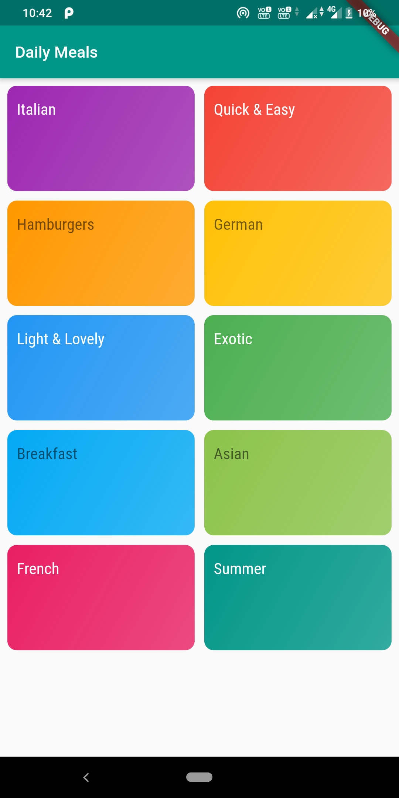
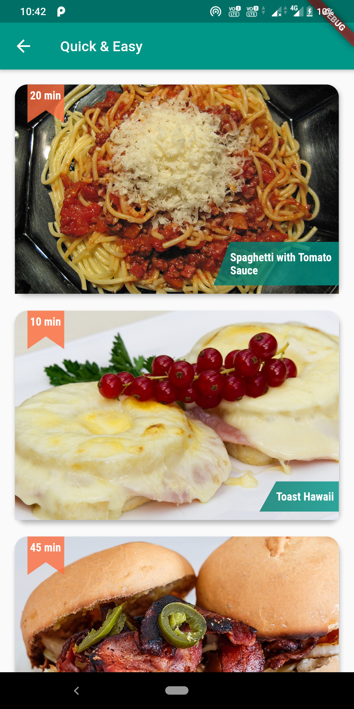
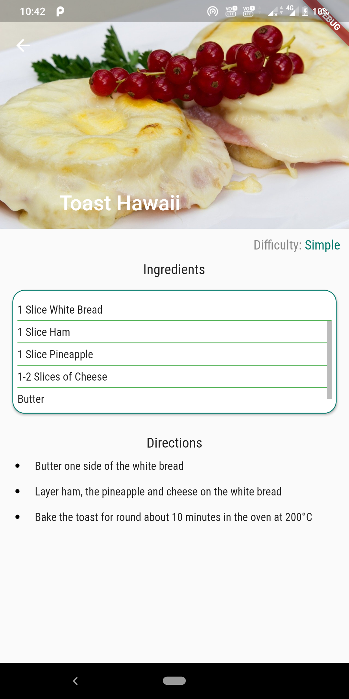

# MealsApp
A simple Flutter app which uses only Dart Code. The application shows a list of Recipes. The Data is Hardcoded. Each Recipe will contain: 
1. A Category 
2. The difficulty it is to replicate 
3. Amount of Time
4. Steps to Reproduce

Functionalities are listed below:

1. Viewing List of Categories to choose from.

2. List of Recipes for a Particular Category 

3. Details of a Particular Receipe 

To Run the App:
1. Clone the Repository
2. Checkout to Tag 1.0.0, and create the APK or AAR as required
